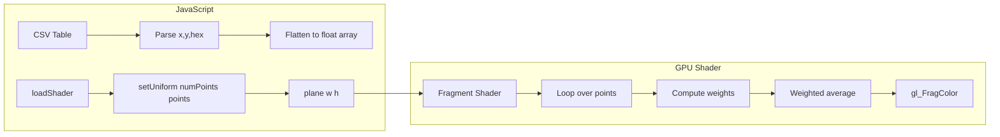

# p5.js Shader for Weighted-Average Gradient from Point Data

## Approach

Draw a full-screen quad (or region) with a custom fragment shader. The shader computes each pixel's color as a **weighted average** of all point colors based on distance—no separate ellipse-drawing step. This gives sub-pixel accuracy and correct handling of overlapping points.

---

## 1. Shader Files vs Inline

**Recommendation: Use separate `.vert` and `.frag` files** with `loadShader()`.

- Cleaner, easier to edit and debug
- Syntax highlighting in editors
- Load in `preload()` so shaders are ready before `setup()`

Create:

- `iviviviv/shaders/points.vert` — standard pass-through vertex shader
- `iviviviv/shaders/points.frag` — fragment shader with weighted-average logic

---

## 2. Passing Variable-Length Data to GLSL

**GLSL does not support dynamic array lengths.** Array size must be fixed at compile time.

**Strategy:**

- Declare a fixed `MAX_POINTS` (e.g. 128 or 256) in the fragment shader
- Pass a `numPoints` uniform (int) for the actual count
- Loop only up to `numPoints` and `break` when done
- If your data exceeds `MAX_POINTS`, either cap it in JS or increase the constant and recompile

**Data format:** Flatten to a single `float` array. Each point = 5 floats: `[x, y, r, g, b]`.

```glsl
// In fragment shader
const int MAX_POINTS = 128;
uniform int numPoints;
uniform float points[MAX_POINTS * 5];  // x,y,r,g,b per point
```

**p5.js `setUniform`:** Pass a flattened JavaScript array. For `vec3`/`vec2` arrays, p5.js expects a **flat** array of numbers (e.g. `[x0, y0, r0, g0, b0, x1, y1, ...]`).

---

## 3. Hex to RGB Conversion

Parse hex in JavaScript before passing to the shader. Your CSV has values like `#FF5733`.

```javascript
function hexToRgb(hex) {
  const result = /^#?([a-f\d]{2})([a-f\d]{2})([a-f\d]{2})$/i.exec(hex);
  return result ? [
    parseInt(result[1], 16) / 255,
    parseInt(result[2], 16) / 255,
    parseInt(result[3], 16) / 255
  ] : [0, 0, 0];
}
```

---

## 4. Coordinate System

Your CSV uses **normalized 0–1** coordinates. p5.js `plane()` with a custom shader provides `vTexCoord` (0–1) in the fragment shader. So `vTexCoord.xy` maps directly to your point coordinates—no extra transform needed.

---

## 5. Weighted Average in the Fragment Shader

For each pixel at `vTexCoord.xy`:

1. For each point `i` in `0..numPoints-1`:
  - `dist = distance(vTexCoord.xy, point.xy)`
  - `weight = 1.0 / (dist * dist + epsilon)` (inverse-distance-squared; adjust formula as needed)
2. Accumulate `sumColor += weight * pointColor`, `sumWeight += weight`
3. `finalColor = sumColor / sumWeight`

Use a small `epsilon` (e.g. 0.0001) to avoid division by zero when a pixel is exactly on a point.

---

## 6. File Structure

```
iviviviv/
├── index.html
├── sketch.js
├── sampledata.csv
├── shaders/
│   ├── points.vert
│   └── points.frag
└── js/
    └── p5.js
```

---

## 7. Sketch Integration

In [sketch.js](iviviviv/sketch.js):

1. **preload()**: `pointsShader = loadShader('shaders/points.vert', 'shaders/points.frag')`
2. **points()** (or a new `gradient()`):
  - Parse table rows into flattened `points` array (x, y, r, g, b)
  - `shader(pointsShader)`
  - `pointsShader.setUniform('numPoints', data.rows.length)`
  - `pointsShader.setUniform('points', flattenedArray)`
  - `pointsShader.setUniform('resolution', [w, h])` (if needed for non-0–1 coords)
  - Draw `plane(w, h)` or `rect()` to cover the region

---

## 8. Vertex Shader (minimal)

Standard pass-through that forwards position and texture coordinates:

```glsl
precision highp float;
attribute vec3 aPosition;
attribute vec2 aTexCoord;
uniform mat4 uModelViewMatrix;
uniform mat4 uProjectionMatrix;
varying vec2 vTexCoord;
void main() {
  gl_Position = uProjectionMatrix * uModelViewMatrix * vec4(aPosition, 1.0);
  vTexCoord = aTexCoord;
}
```

---

## 9. Local Hosting Note

`loadShader()` fetches files via HTTP. For a locally hosted site, use a simple static server (e.g. `npx serve`, `python -m http.server`, or VS Code Live Server) so paths like `shaders/points.vert` resolve correctly. Opening `index.html` directly (file://) may fail due to CORS.

---

## 10. Optional: Exceeding MAX_POINTS

If you expect more than 128–256 points:

- Increase `MAX_POINTS` in the shader and recompile
- Or split into multiple draw passes / textures
- Or use a texture to store point data (more advanced)

---

## Summary Flow




